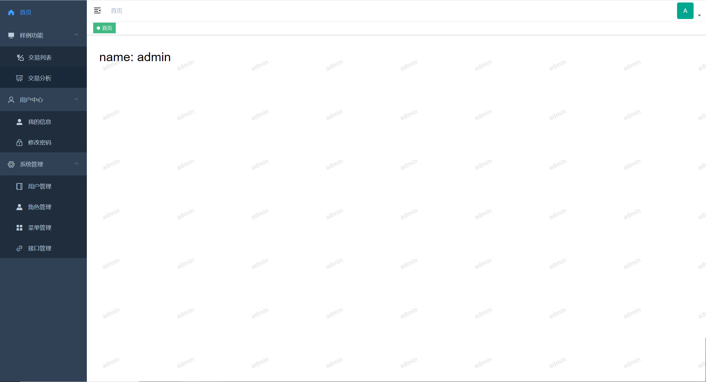
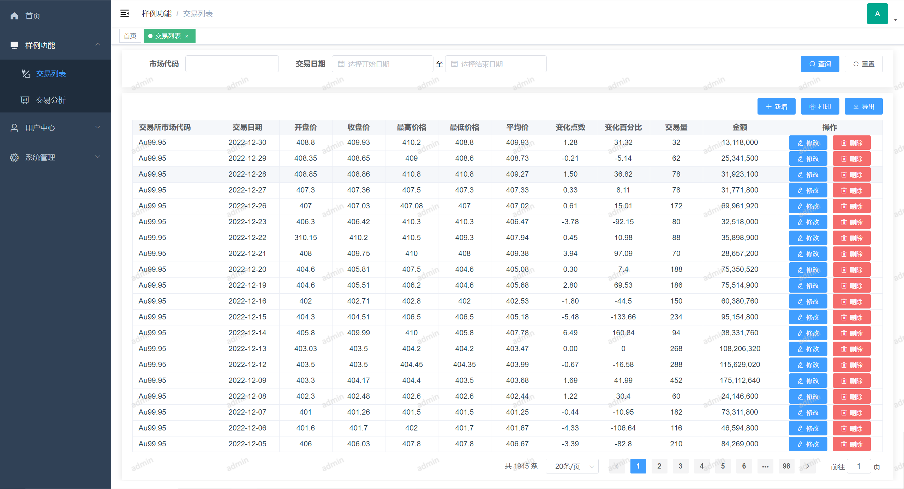
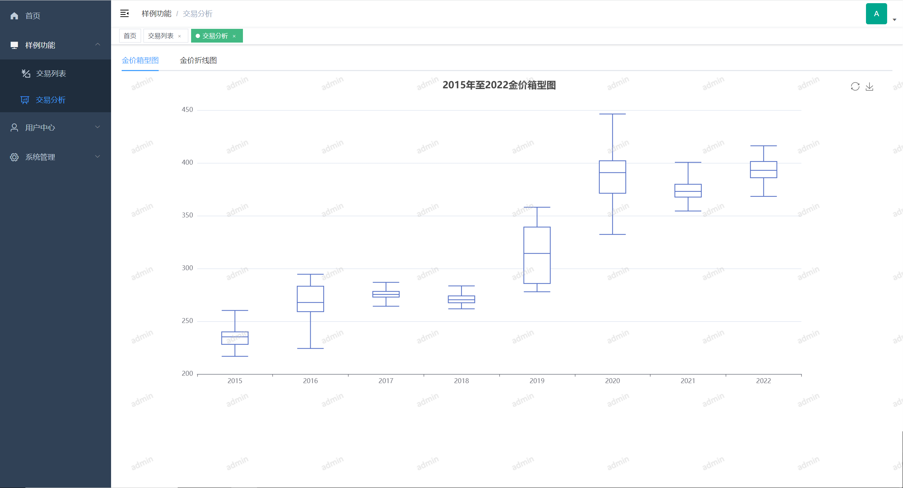

# mbp_back

### 项目简介

mbp是一个管理系统的基础项目模板，其主要作用是提供管理系统的基础功能，使开发者不必再次开发重复的功能，可以更快的进入核心业务的开发。




### 基础功能

首页：目前为空白页面，开发者可根据业务需求修改。

用户中心：提供用户修改自身信息的功能。

​	我的信息：修改用户自身基本信息。

​	修改密码：修改用户自身密码。

系统管理：管理员对系统的操作功能。

​	用户管理：管理系统的所有用户，其中包括：条件查询、新增、修改、删除、启用用户，用户权限角色分配。

​	角色管理：管理系统的所有权限角色，其中包括：条件查询、新增、修改、删除、启用角色，角色菜单、角色接口的权限分配（可选）。

​	菜单管理：管理系统的所有菜单，其中包括：条件查询、新增、修改、删除、隐藏菜单。

​	接口管理（可选）：管理系统的所有接口，自动获取后台接口信息，可控制接口的开启（系统设置的白名单不受控制）。


### 样例功能

样例功能：提供一些样例功能。

​	交易列表：一个查询列表展示，其中包括：条件查询、新增、修改、删除、自定义分页查询、数据导出。

​	交易分析：使用Echarts对交易列表的数据进行可视化，其中包括：箱型图和折线图。

​	（以上数据说明，来源与网络[和鲸社区](https://www.heywhale.com/home)，数据为2015年至2022年Au99.95（黄金）交易数据）


#### 样例功能展示

|  |          |
| --------------------------------- | ----------------------------------------- |
|  |  |


### 技术栈

- Spring Boot 2.7.0
- MySQL 8.0.20
- MyBatis 2.2.2
- MyBatis-Plus 3.5.1
- Redis 6.05
- Lombok 注解
- Swagger + Knife4j 3.0.3 接口文档
- HuTool 5.8.16 工具类库
- EasyExcel 3.3.2 Excel工具


### 本地调试

1.下载源码到本地。

2.更新maven确保引用正确。

3.安装中间件：MySQL 8.0.20 和 Redis 6.05。

4.通过 sql/mbp.sql 文件在MySQL中带入数据。

5.修改 src/main/resources/application.yml 下的配置。

6.点击 /src/main/java/com/yingwu/project/MyApplication.java 的启动按钮即可。

​	application.yml修改配置说明：

```yml
datasource:
    driver-class-name: com.mysql.cj.jdbc.Driver	# 数据库连接驱动，这里使用的是MySQL
    url: jdbc:mysql://192.168.10.22:3306/mbp # 数据库连接地址（3306为MySQL默认端口）
    username: root # 数据库用户
    password: 123456 # 数据库用户密码

redis:
    port: 6379 # Redis端口（6379为Redis默认端口）
    host: 192.168.10.22 # Redis访问地址
    database: 0 # 指定Redis的库
    password: 123456 # Redis密码
    
server:
  port: 7529 # 项目启动端口

# hutool雪花token生成参数
snowflake: 
  workerId: 1 # 参数1为终端ID
  datacenterId: 1 # 数据中心ID

# 系统可选功能
powerconfig: 
  interfaceAuth: true # 开启系统接口鉴权 true | false
```


### 开发上手

正在建设中...

### 打包和部署

正在建设中...
