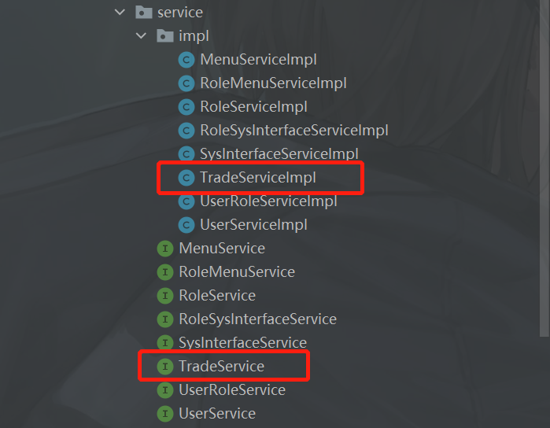
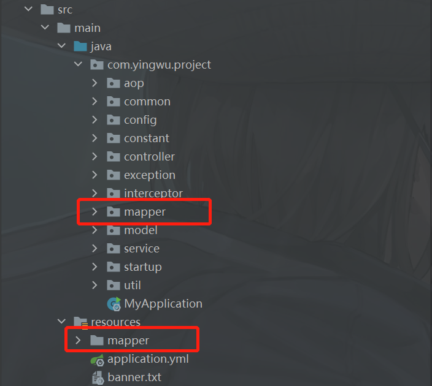

# mbp_back

### 项目简介

mbp是一个管理系统的基础项目模板，其主要作用是提供管理系统的基础功能，使开发者不必再次开发重复的功能，可以更快的进入核心业务的开发。

目前提供了：登录、注册、用户管理、RBAC权限管理（用户权限）的基础功能。

样例功能：简单的增删改查、表格导出、表格分页打印、Echats图表。

后端代码提供特色：

1.引入了HuTool，可以通过查看[官方文档](https://hutool.cn/docs/#/)来使用很多便捷的功能，目前项目中使用了其提供的雪花ID和构建树的工具。

2.项目依赖与Redis，可以将需要的数据缓存在Redis上来加速访问。

3.项目中提供基于Redisson漏桶限流的自定义注解，注解上配置有相关参数，可以更好的控制限流标准。

4.依赖与RabbitMQ，提供可选的日志记录功能（不建议开启），可通过yml文件配置选择性使用RabbitMQ和日志记录功能。

采用前后端分离的方案，这里为**后端项目**，前往[前端项目](https://github.com/DY56GO/mbp_front)。

[更新日志](https://github.com/DY56GO/mbp_back/blob/master/UPDATELOG.md)


|  |  |
| ------------------------- | ------------------------- |
|  |  |


### 功能列表

- 首页：目前为空白页面，开发者可根据业务需求修改。

- 样例功能：提供一些样例功能。

​			交易列表：一个查询列表展示，其中包括：条件查询、新增、修改、删除、数据导出。

​			交易分析：使用Echarts对交易列表的数据进行可视化，其中包括：箱型图和折线图。

​			（交易数据说明，来源于[和鲸社区](https://www.heywhale.com/home)，数据为2015年至2022年Au99.95（黄金）交易数据）

- 用户中心：提供用户修改自身信息的功能。

​			我的信息：修改用户自身基本信息。

​			修改密码：修改用户自身密码。

- 系统管理：管理员对系统的操作功能。


​			用户管理：管理系统的所有用户，其中包括：条件查询、新增、修改、删除、启用用户，用户权限角色分配。

​			分组管理：管理系统的所有用户组，其中包括：条件查询、新增、修改、删除。

​			角色管理：管理系统的所有权限角色，其中包括：条件查询、新增、修改、删除、启用角色，角色菜单、角色接口的权限分配（可选）。

​			菜单管理：管理系统的所有菜单，其中包括：条件查询、新增、修改、删除、隐藏菜单。

​			接口管理（可选）：管理系统的所有接口，自动获取后台接口信息，可控制接口的开启（系统设置的白名单不受控制）。

- 日志管理：提供系统记录日志的功能，请根据情况选择性使用（开启），特别是请求日志功能，不建议开启，线上的请求会很多。

​			登录日志（可选）：记录登录。

​			请求日志（可选）：记录请求。


### 技术栈

- Spring Boot 2.7.0
- MySQL 8.0.20
- MyBatis 2.2.2
- MyBatis-Plus 3.5.1
- Redis 6.05
- Redisson 3.16.0
- RabbitMQ 3.8.5
- Lombok 注解
- Swagger + Knife4j 3.0.3 接口文档
- HuTool 5.8.16 工具类库
- EasyExcel 3.3.2 Excel工具


### 本地调试

1.下载源码到本地。

```shell
# 克隆项目
git clone https://github.com/DY56GO/mbp_back.git
```

2.更新maven确保引用正确。

3.安装中间件：MySQL 8.0.20 和 Redis 6.05。

4.通过 sql/mbp.sql 文件在MySQL中导入数据。

5.修改 src/main/resources/application.yml 下的配置。

6.点击 /src/main/java/com/yingwu/project/MyApplication.java 的启动按钮即可。

7.可选功能中 “日志管理” 依赖与RabbitMQ，如果你的项目不需要RabbitMQ，可以将application.yml中的spring.rabbitmq.enabled修改为false。

​	application.yml修改配置说明：

```yml
datasource:
    driver-class-name: com.mysql.cj.jdbc.Driver	# 数据库连接驱动，这里使用的是MySQL
    url: jdbc:mysql://localhost:3306/mbp # 数据库连接地址（3306为MySQL默认端口）
    username: root # 数据库用户
    password: 12345678 # 数据库用户密码
    
# redis 配置
redis:
    port: 6379 # Redis端口（6379为Redis默认端口）
    host: localhost # Redis访问地址
    database: 0 # 指定Redis的库
    password: 123456 # Redis密码
    
# mq配置
rabbitmq:
    # 配置rabbitMq启用开关
    enabled: true
    host: localhost # RabbitMQ访问地址
    port: 5672 # RabbitMQ端口（5672为RabbitMQ默认端口）
    username: guest
    password: 1234567
    listener:
      simple:
        retry:
          enabled: true
          max-attempts: 3 #最大重试次数
          initial-interval: 3000 #重试间隔时间（单位毫秒）
    
server:
  port: 7529 # 项目启动端口

# hutool雪花token生成参数
snowflake: 
  workerId: 1 # 参数1为终端ID
  datacenterId: 1 # 数据中心ID

# 系统功能
powerconfig:
  interfaceAuth: true # 开启系统接口鉴权 true | false
  # 注意：日志功能依赖RabbitMQ
  loginLogRecords: true # 开启登录日志记录 true | false
  requestLogRecords: false # 开启请求日志记录 true | false （不建议开启，线上的请求过多）
```


### 开发上手

可以通过参照其中样例功能的实现来熟悉基本的代码开发，建议从controller开始，逐步到service、model、mapper，完成简单的crud，才慢慢的去熟悉其他的功能（Token登陆、拦截器鉴权、角色权限RABC等）。

| 描述                                                         | 图片                                                        |
| ------------------------------------------------------------ | ----------------------------------------------------------- |
| 在controller下提供样例功能（交易接口）Tradecontroller类，里面包含了简单的增删改查，以及一个表格导出。 |  |
| 在service下为交易接口服务的接口和实现类，主要是对数据库的操作，及一个简单的数据校验。 |  |
| 注意model下会分dto、entity、vo以及excel的维度对实体类进行一定规范和控制，同时有利于Swagger文档生成。 |  |
| 对于数据库的映射操作，可以在mapper中查看。                   |  |


### **打包和部署**

这里提供一个简单的打包部署方式，具体为：以jar的方式对项目进行打包和部署，使用Docker管理中间件（Redis、MySql），Java为本地环境。

#### 打包

| 描述                                                         | 图片                                                         |
| ------------------------------------------------------------ | ------------------------------------------------------------ |
| 1.建议是新建一个生产环境的profiles文件，以来区分开发环境和生产环境。 |  |
| 2.通过Maven的package命令打包为jar包。                        |  |
| 3.打包后的jar包在项目的target文件夹下。                      |  |


#### 部署

主要分为两步，一：环境搭建，二：运行jar包。

由于篇符过长，环境搭建请到deployment目录下查看“[服务器环境.md](https://github.com/DY56GO/mbp_back/blob/master/deployment/%E6%9C%8D%E5%8A%A1%E5%99%A8%E7%8E%AF%E5%A2%83.md)“进行操作。

运行jar，下面的命令与deployment目录下的“[启动命令.txt](https://github.com/DY56GO/mbp_back/blob/master/deployment/%E5%90%AF%E5%8A%A8%E5%91%BD%E4%BB%A4.txt)”为相同内容。

```shell
# 查看当前运行的 Java 项目
ps aux|grep java

# 杀死进程
kill pid

# 强制杀死进程
kill -9 pid

# 打开 jar 所在目录
cd /home/projects/mbp/code/mbp_back/

# 启动 mbp_back 到后台，其中“--spring.profiles.active=prod”为指定profiles使用生产环境，“mbp_back.log”为日志文件
nohup java -jar mbp_back-1.0.0.jar --spring.profiles.active=prod > mbp_back.log
```

