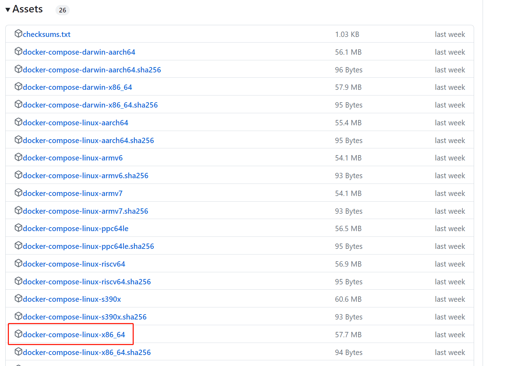
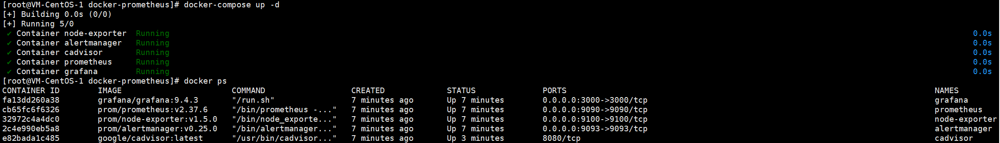

# 服务器初始化操作

## 重装系统

如果购买的服务器操作系统不是自己需要的系统，可以通过厂商的面板进行重装。

这里统一使用Centos7.6


## 重置密码并登录

重装的系统或首次使用的系统，都需要重置密码并进行一次面板登录（都要在面板进行操作），才能使用其他工具进行登录。


## 使用XShell登录

如果没有绿色版版，可以在官方下载免费的版本：https://www.xshell.com/zh/free-for-home-school/。

安装XShell然后登录服务器即可。


# 服务器资源规划

## 项目文件

### 存放形式

以项目为整体进行存放，如mbp项目，虽然分为前后端两个项目，但应该都存放在mbp一个目录下

优点：

1. 保证项目的完整性
2. 便于整个项目进行调整时的操作（跨目录点击方便）

### 存放位置

项目统一存放在【/home/projects/project_name】目录下


## 项目依赖资源

### 直接安装的依赖

Java、Go、PHP 等语言环境

说明：这些环境通常不会发生变动，为了减少麻烦，可以直接安装到系统环境中

### Docker统一部署

Nginx（前端）、MySql（后端）、Redis（后端）、RabbitMQ（后端）

优点：

1. 屏蔽了系统对于这些应用的影响
2. 对于多个项目来说，有较好的隔离性
3. 方便接口的管理
4. 安装和卸载方便

缺点：

1. 有学习Docker的成本
2. 给系统的部署增加了复杂性，维护变得复杂


# 服务器安装资源

## yum

```shell
# 设置yum源（也可以设置成国内的阿里源等）
yum-config-manager --add-repo https://download.docker.com/linux/centos/docker-ce.repo

# 更新yum
yum update
```


## Java

```shell
# 查看可安装的java版本
yum -y list java*

# 安装java1.8
yum -y install java-1.8.0-openjdk
```


## Docker

### Docker安装

```shell
# 查看Linux核心版本，3.10版本及以上才可以安装Docker
uname -r

# 查看Docker是否曾经安装过
whereis docker

# 如果安装过，就卸载旧版本，没有安装，也可执行
yum remove docker docker-common docker-selinux docker-engine

# 安装所需要的软件包
yum install -y yum-utils device-mapper-persistent-data lvm2

# 查看可安装的Docker版本 
yum list docker-ce --showduplicates | sort -r

# 安装Docker（默认全部选y）
yum install docker-ce

# 安装某特定版本需增加版本号（例如： 18.06.0.ce-3.el7）
yum install docker-ce-18.06.0.ce

# 查看docker是否安装成功
docker version

# 启动
systemctl start docker

# 停止
systemctl stop docker

# 重启
systemctl restart docker

# 开机自启
systemctl enable docker
```


### Docker Compose安装

#### 在线安装

```shell
curl -SL https://github.com/docker/compose/releases/download/v2.18.0/docker-compose-linux-x86_64 -o /usr/local/bin/docker-compose
```

添加可执行权限：

```shell
chmod +x /usr/local/bin/docker-compose
```


#### 离线安装

下载地址：https://github.com/docker/compose/releases



然后将其移动到/usr/local/bin目录下，并将其改名为docker-compose：

```shell
mv docker-compose-linux-x86_64 /usr/local/bin/docker-compose
```

添加可执行权限：

```
chmod +x /usr/local/bin/docker-compose
```

安装docker-compose（此处docker-compose目录上传到了服务器的/usr/local/bin/docker-compose，根据自己上传的目录修改）：

```shell
ln -s /usr/local/bin/docker-compose /usr/bin/docker-compose
```

测试

```shell
docker-compose version
```

如果显示Permission denied，则代表[docker-compose命令](https://so.csdn.net/so/search?q=docker-compose命令&spm=1001.2101.3001.7020)权限不够。执行以下命令：

```shell
cd /usr/bin
chmod 777 docker-compose
sudo chmod +x /usr/local/bin/docker-compose
```


### Nginx镜像

#### 第一步

复制Nginx映射目录和文件（当前目录/nginx）到项目目录下的nginx目录下

#### 第二步

根据项目情况，修改附带的buildNginx.sh（当前目录/docke）脚本文件，创建Nginx镜像

```shell
# build Nginx

docker pull nginx

# ports:
# - "80:80"
# - "443:443"

# volumes:
# - /home/projects/mbp/nginx/conf:/etc/nginx/
# - /home/projects/mbp/nginx/logs:/var/log/nginx
# - /home/projects/mbp/nginx/html:/usr/share/nginx/html

docker run --restart=on-failure:5 \
--privileged=true \
--name nginx-mbp \
-p 80:80 \
-p 443:443 \
-v /home/projects/mbp/nginx/conf:/etc/nginx \
-v /home/projects/mbp/nginx/conf/nginx.conf:/etc/nginx/nginx.conf \
-v /home/projects/mbp/nginx/logs:/var/log/nginx \
-/home/projects/mbp/code/mbp_front:/usr/share/nginx/html \
-d nginx \
```

#### 附带文件

1. Nginx映射目录和文件【当前目录/nginx】
2. Nginx构建镜像sh脚本（如果构建不顺利，查看内部的命令，逐一执行来排除问题）【当前目录/docker/bulidNginx.sh】

#### 注意

1. 注意创建映射目录和文件（即使目录下没有任何文件），**建议使用附带文件，避免错误**
2. 注意下拉的Nginx版本，这里默认使用最新版本
3. Nginx镜像下拉很慢，建议更换源，参考：https://www.jianshu.com/p/c211a51d52f5
4. 注意系统防火墙是否开启，导致端口无法访问
5. 注意服务器端口是否开启，导致端口无法访问（厂商面板）


### MySql镜像

#### 第一步

复制MySql映射目录和文件（当前目录/mysql）到项目目录下的mysql目录下

#### 第二步

根据项目情况，修改附带的buildMySql.sh（当前目录/docke）脚本文件，创建MySql镜像

```shell
# build MySql

docker pull mysql:8.0.20

# ports:
# - "3306:3306"

# volumes:
# - /home/projects/mbp/mysql/conf/my.cnf:/etc/mysql/my.cnf
# - /home/projects/mbp/mysql/data:/var/lib/mysql

# MYSQL_ROOT_PASSWORD:tj2feMK8ppTyLlei

docker run --restart=on-failure:5 \
--privileged=true \
--name mysql-mbp \
-p 3306:3306 \
-v /home/projects/mbp/mysql/conf/my.cnf:/etc/mysql/my.cnf \
-v /home/projects/mbp/mysql/data:/var/lib/mysql \
-e MYSQL_ROOT_PASSWORD=12345678 \
-d mysql:8.0.20 \
```

#### 附带文件

1. MySql映射目录和文件【当前目录/mysql】
2. MySql构建镜像sh脚本（如果构建不顺利，查看内部的命令，逐一执行来排除问题）【当前目录/docker/bulidNginx.sh】

#### 注意

1. 注意创建映射目录和文件（即使目录下没有任何文件）
2. 注意下拉的MySql版本，这里使用8.0.20
3. 在sh脚本中含有root用户的密码设置，注意设置，默认：12345678


### Redis镜像

#### 第一步

复制Redis映射目录和文件（当前目录/redis）到项目目录下的Redis目录下

#### 第二步

根据项目情况，修改附带的buildMySql.sh（当前目录/docke）脚本文件，创建MySql镜像

```shell
# build Redis

docker pull redis:6.0

# ports:
# - "6379:6379"

# volumes:
# - /home/projects/mbp/redis/conf/redis.conf:/etc/redis.conf
# - /home/projects/mbp/redis/data:/data


docker run --restart=on-failure:5 \
--privileged=true \
--name redis-mbp \
-p 6379:6379 \
-v /home/projects/mbp/redis/conf/redis.conf:/etc/redis/redis.conf \
-v /home/projects/mbp/redis/data:/data \
-d redis:6.0 redis-server /etc/redis/redis.conf --requirepass 12345678 \
```

#### 附带文件

1. Redis映射目录和文件【当前目录/redis】
2. Redis构建镜像sh脚本（如果构建不顺利，查看内部的命令，逐一执行来排除问题）【当前目录/docker/bulidRedis.sh】

#### 注意

1. 注意创建映射目录和文件（即使目录下没有任何文件）
2. 注意下拉的Redis版本，这里使用6.0
3. 在sh脚本中含有密码设置，注意设置，默认：12345678
4. 注意映射配置文件【当前目录/redis/conf/redis.conf】中的配置

```shell
# redis.conf需要注意的配置
daemonize no  #后台启动(注意这里要改为no，即非后台启动，因为会和docker run -d 冲突)
 
# 关闭保护模式，开启的话，只有本机才可以访问Redis
protected-mode no  
 
# 设置登录密码
requirepass 123456
 
# 开启aof持久化
appendonly yes
```


### RabbitMQ镜像

#### 第一步

创建RabbitMQ的映射文件

#### 第二步

根据项目情况，修改附带的buildRabbitMQ.sh（当前目录/docke）脚本文件，创建RabbitMQ镜像

```shell
# build RabbitMq

docker pull rabbitmq:3.8.5

# ports:
# - "15672:15672"
# - "5672:5672"

# volumes:
# - /home/projects/mbp/rabbitmq/data:/var/lib/rabbitmq

docker run --restart=on-failure:5 \
--privileged=true \
--name rabbitmq-mbp \
-p 15672:15672 \
-p 5672:5672 \
-v /home/projects/mbp/rabbitmq/data:/var/lib/rabbitmq \
-d rabbitmq:3.8.5 \
```

#### 第三步

使用 账号：guest（默认），密码：guest（默认），登录http://localhost:15672/，修改密码

#### 附带文件

1. RabbitMq构建镜像sh脚本（如果构建不顺利，查看内部的命令，逐一执行来排除问题）【当前目录/docker/bulidRabbitMq.sh】


### prometheus和grafana

#### 第一步

复制附件中docker-prometheus到服务器中（看个人使用习惯放置到自己的位置就好）

#### 第三步

打开服务器中第一步复制进去的docker-prometheus目录，使用docker-compose命令执行对应的yaml文件进行进行创建

```shell
# 打开docker-prometheus目录
cd docker-prometheus

# 执行docker-compose命令
docker-compose up -d
```



#### 附带文件

1. docker-prometheus，对应的conf和docker-compose文件

#### 注意

**注意附件中alertmanager配置文件的邮箱和grafana的密码**

若果没有cadvisor启动，执行一下命令，然后再次执行docker-compose命令

```shell
# cadvisor没有启动
mount -o remount,rw '/sys/fs/cgroup'
ln -s /sys/fs/cgroup/cpu,cpuacct /sys/fs/cgroup/cpuacct,cpu

# 执行docker-compose命令
docker-compose up -d
```


| 应用          | 访问地址                      | 备注           |
| ------------- | ----------------------------- | -------------- |
| prometheus    | http://localhost:9090         | 无账号和密码   |
| grafana       | http://localhost:3000         | admin/自己设置 |
| alertmanager  | http://localhost:9093         | 无账号和密码   |
| node-exporter | http://localhost:9100/metrice | 无账号和密码   |

